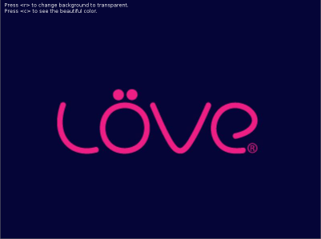
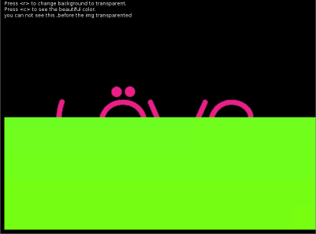



love虽然没有提供直接操纵顶点颜色的函数,但是提供了和glsl-1.2(opengl着色语言)兼容的pixeleffect.
这相当于鸟枪换炮,当然先应的难度也加大了.什么是着色语言?它是在显卡上执行的可编程渲染管线(显卡在处理
数据的时候是按照一个固定的顺序来的，而且严格按照这个顺序,所以叫管线),具体见
[百科](http://baike.baidu.com/view/1620896.htm).

glsl还是比较复杂的,这里是csdn上的一系列[教程](http://blog.csdn.net/racehorse/article/details/6593719).
我只是大致看了一下,也没动手,不过在love2d官方论坛找到了一些示例.

下面大概说明一下glsl.

glsl分为顶点着色器和片元着色器.
数据类型有

基础类		
int,float

向量类		
vec2、vec3、vec4 (float vector)		
ivec2、ivec3、ivec4 (int vector)		
bvec2、bvec3、bvec4 (bool vector)		
mat2、mat3、mat4 (float matrix)

纹理类		
sampler1D、 sampler2D、 sampler3D、		
samplerCube、sampler1DShadow、		
sampler2DShadow		

变量修饰符,详见这篇[文章](http://danal.blog.51cto.com/3353275/888401)
		
uniform  用户自定义的图元属性,用于从OpenGL程序传送属性数据给Vertex Shader、Fragment Shader,在GLSL中只读.

varying:用于从Vertex Shader向Fragment Shader传送插值数据,需要在这两个Shader中均需要声明。Vertex Shader中可写,在Fragment Shader中只读。

attribute:用户自定义的顶点属性,用于从OpenGL程序传送属性数据给Vertex Shader,在GLSL中只读.

注意在love里修改了一些名称如下		
<table border="1">
<tr>
<th>glsl</th>
<th>love</th>
</tr>
<tr>
<td>float</td>
<td>number</td>
</tr>
<tr> <td>sampler2d</td> <td>image</td></tr>
<tr> <td>uniform</td> <td>extern</td></tr>
<tr> <td>texture2d(tex, uv)</td> <td>texel(tex, uv)</td> </tr>
</table>

在love里pixeleffect的使用可以分为三步:		
1.创建效果		
effect=love.graphics.newPixelEffect[[		
//glsl着色语言,glsl类c,注释用"//"		
]]		
2.使用效果		
love.graphics.setPixelEffect(effect)		
--绘图代码		
love.graphics.setPixelEffect()--注意还原默认效果		
3.若需要传单参数可以		
effect:send()		
注意每个effect必须有一个名为"effect"的函数即vec4 effect( vec4 color, image texture, vec2 texture_coords, vec2 screen_coords ).

下面我们通过一个去除图片背景和颜色例子,来看一下pixeleffect的强大功能.			
按"r"去除背景,按"c"颜色变换.效果如下:		
		

<pre class="prettyprint lang-lua">
function love.load()
    --为了方便书写
	gr, li, lf	= love.graphics, love.image, love.filesystem

	image			= gr.newImage('Love.jpg')
	width, height	= gr.getWidth(), gr.getHeight()
	effect = gr.newPixelEffect [[
		extern vec4 Cmin;
		extern vec4 Cmax;
		vec4 effect(vec4 color,Image tex,vec2 tc,vec2 pc)
		{	vec4 pixel = Texel(tex,tc);
			//vec4的四个分量分别是r,g,b,a
			//下面把图片在cmax和cmin之间的像素的alpha分量设为0,即透明
			if ((pixel.r<=Cmax.r && pixel.r>=Cmin.r) &&
				(pixel.g<=Cmax.g && pixel.g>=Cmin.g) &&
				(pixel.b<=Cmax.b && pixel.b>=Cmin.b))
			{pixel.a        = 0;}
			return pixel;
		}
		]]

	--需要移除的像素范围,这与具体的图片相关,如此图,背景为蓝色,主体为粉红,
	--除了红色分量处的alpha不变,其他分量处的alpha都设为0
	remove_range = {
		r = { 0, 125 },
		g = { 0, 255 },
		b = { 0, 255 }
		}
	--opengl的颜色范围0.0--1.0,值越小表明此分量占的比例越小
	remove_min = {remove_range.r[1]/255,remove_range.g[1]/255,remove_range.b[1]/255,1}
	remove_max = {remove_range.r[2]/255,remove_range.g[2]/255,remove_range.b[2]/255,1}
	effect:send('Cmin',remove_min) --向cmin传值
	effect:send('Cmax',remove_max)
	remove = false --透明变换开关

	-- 颜色变换效果
	effect2= love.graphics.newPixelEffect [[
        extern number time;
        vec4 effect(vec4 color, Image texture, vec2 texture_coords, vec2 pixel_coords)
        {
		//这些函数为了保证值在0.0--1.0之间,三角函数取值为-1.0--1.0
            return vec4((1.0+sin(time))/2.0, abs(cos(time)), abs(sin(time)), 1.0);
        }

    ]]
	change=false --颜色变换开关
end

function love.draw()
    --由于love是按先后顺序绘图,如果图片不透明,此据会被挡住
	gr.print('you can not see this ,before the img transparented',10,40)
	if remove then
		gr.setPixelEffect( effect )
		gr.draw( image )
		gr.setPixelEffect() --还原默认的效果
		else
		gr.draw( image )
	end
	if change then
		gr.setPixelEffect(effect2)
		gr.rectangle('fill', 10,305,790,285)
		gr.setPixelEffect()

	end

	gr.print( 'Press <r> to change background to transparent.', 10, 10)
	gr.print( 'Press <c> to see the beautiful color.', 10, 25)

end

local t=0
function love.update(dt)
	 t = t + dt
    effect2:send("time", t)

end

function love.keypressed(key)
	if key == 'escape'	then love.event.push( 'quit' )	end
	if key=="c" then change = not change end
	if key == 'r'		then remove = not remove end
end

</pre>

glsl功能非常多,演示的也只是皮毛,它可以用来做[hdr](http://baike.baidu.com/view/74850.htm),[bloom](http://baike.baidu.com/view/1095933.htm),
运动模糊，灰度/反转/复古色/任何种类的色彩效果，反射/折射/扭曲等等！